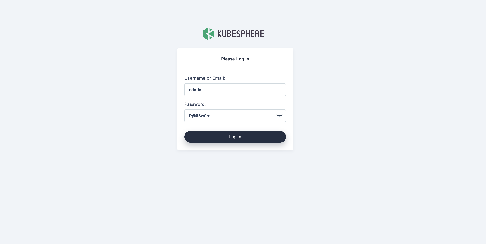
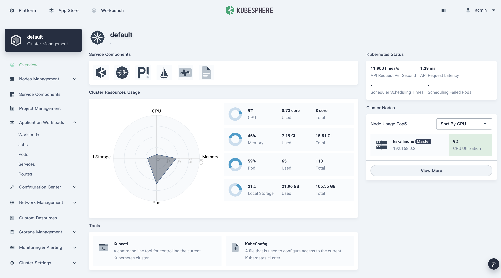
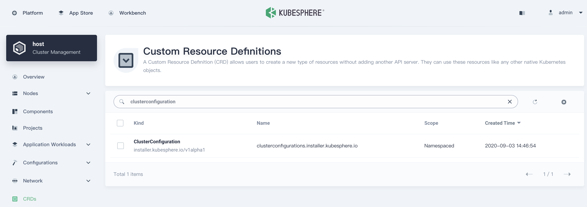
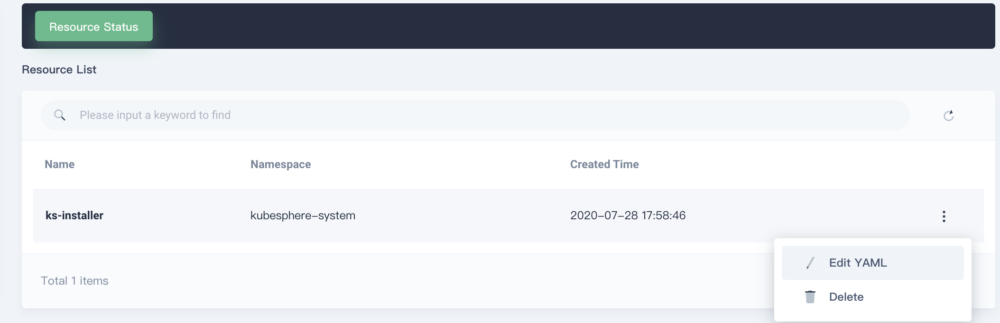
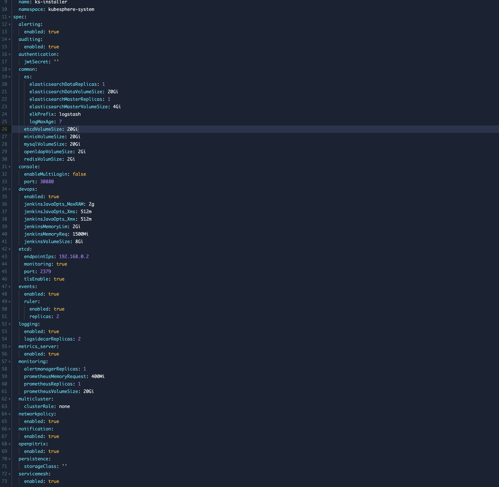

// Add steps as necessary for accessing the software, post-configuration, and testing. Don’t include full usage instructions for your software, but add links to your product documentation for that information.
//Should any sections not be applicable, remove them

== Test the deployment
// If steps are required to test the deployment, add them here. If not, remove the heading

. Log in to the bastion host using your configured key pair and the user name `ec2-user`. You can get the IP address of the bastion host from the *Outputs* tab of the AWS CloudFormation console.

 ssh -i "~/.ssh/cap.pem" ec2-user@12.23.34.45

[start=2]
. Verify that the client software was installed through the bastion host:

* Kubectl version:

 $ kubectl version

* Helm version:

 $ helm version

[start=3]
. Verify the health of the Amazon EKS cluster through the bastion host. Use the installed `kubectl` and `helm` commands to verify access to the environment and the running state of the cluster and packages. The installation was successful if you see the welcome-information outputs in the log.

    $ kubectl cluster-info

    $ kubectl get nodes

    $ kubectl logs -n kubesphere-system $(kubectl get pod -n kubesphere-system -l app=ks-install -o jsonpath='{.items[0].metadata.name}') -f

    $ kubectl get pods --all-namespaces

[start=4]
. Retrieve the generated URL of the KubeSphere console from the outputs list. Access it in your browser, and log in to the KubeSphere console using the administrator account and password defined by `KubeSphereConsolePassword`.

[#KubeSphereLogin1]
.KubeSphere login page
[link=images/image4.png]

[#KubeSphereLogin2]
.KubeSphere dashboard
[link=images/image5.png]

== Best practices for using {partner-product-short-name} on AWS
// Provide post-deployment best practices for using the technology on AWS, including considerations such as migrating data, backups, ensuring high performance, high availability, etc. Link to software documentation for detailed information.

As mentioned in the table _KubeSphere System and Pluggable Configuration of link:#option-1-parameters-for-deploying-kubesphere-into-a-new-vpc[Step3]_, KubeSphere has 11 pluggable components, which can be enabled individually. If you don't enable them, KubeSphere starts with a minimal installation by default. Ensure that you have the necessary CPU and memory requirements in your cluster. For more information, see the https://kubesphere.io/docs/pluggable-components/overview/[KubeSphere Overview^].

The optimal configuration for running KubeSphere Container Platform on an Amazon EKS cluster requires a minimum of one worker node that has at least 16 GiB RAM and 4 CPUs. We recommended that you enable these pluggable components to discover the full-stack features and capabilities provided by KubeSphere. If you already have a minimal KubeSphere setup, you can still enable the pluggable components by editing the cluster's configuration as follows:

Use an administrative account to access *Cluster Management*. Choose the EKS cluster, and select *CRDs* from the left-hand menu. Search for *ClusterConfiguration*.

Choose the *ClusterConfiguration* resource page. Choose *···* from the list, and select *Edit YAML*.

Scroll down to the *spec* section, and change the pluggable components from *false* to *true* for the features you want. Finally, choose *Update* to save your changes. The installation automatically starts at the backend.

Open the *Web kubectl* from *Toolbox* (**bottom right**), and inspect the installation logs:

 $ kubectl logs -n kubesphere-system $(kubectl get pod -n kubesphere-system -l app=ks-install -o jsonpath='{.items[0].metadata.name}') -f

When you see welcome information in the output logs, the pluggable components are ready to use.

== Security
// Provide post-deployment best practices for using the technology on AWS, including considerations such as migrating data, backups, ensuring high performance, high availability, etc. Link to software documentation for detailed information.

*Set up the TLS*: This Quick Start automatically sets up Elastic Load Balancing (ELB) to support the critical services of a KubeSphere container platform cluster. We recommend that you set up the TLS for you Network Load Balancer to establish a secure connection between the client and server. This helps to ensure that all data passed between the client and your load balancer is private, for more information, see file:///Users/zhoupengfei/Downloads/TLS%20listeners%20for%20your%20Network%20Load%20Balancer[TLS listeners for your Network Load Balancer^].

*Keep the secret private*: KubeSphere supports multicluster management in a unified control plane. Save the secrets used to connect to the external cluster. For more information, see https://kubesphere.io/docs/multicluster-management/enable-multicluster/direct-connection/[Direct Connection^].

*Create proper multitenant management policies:* KubeSphere is a multitenant platform. Multitenancy in KubeSphere refers to one or more clusters that are shared between tenants. Ensure that you set the proper roles, permissions, and projects for tenants. For more information, see https://kubesphere.io/docs/quick-start/create-workspace-and-project/[Create Workspace, Project, Account and Role^].

*Create proper network policies:* KubeSphere allows administrators to set network policies for different projects (namespaces) and workspaces. To control network communication between pods in each cluster's projects and workspaces, create https://cloud.google.com/kubernetes-engine/docs/how-to/network-policy[network policies^] based on your tenants' requirements. We recommend that you block traffic among projects that host different tenant applications. Also, deny all 
//TODO Replace "ingress" with "receive," "input," "inbound," or "incoming."
incoming traffic to avoid pods from one project mistakenly sending traffic to another project's services or databases.

//== Other useful information
//Provide any other information of interest to users, especially focusing on areas where AWS or cloud usage differs from on-premises usage.

== Get started with KubeSphere

When you finish deploying this Quick Start, refer to the

 https://kubesphere.io/docs/quick-start/create-workspace-and-project/[KubeSphere Getting Started Guide^]. It has hands-on labs and tutorials that can help you get started with KubeSphere.

== Central control plane for multicloud and multicluster management

If you want to build a hybrid cloud for multicloud and multicluster management, enable Kubernetes federation to set up a central control plane using KubeSphere. KubeSphere supports application distribution across multiple clusters and cloud providers. It also provides disaster recovery and cross-cluster observability. For more information, see 
//TODO The following link is local and hence doesn't resolve:
file:///Users/ameighta/Documents/Projects/QuickStart-Projects/QingCloud-KubeSphere/How%20to%20Enable%20the%20Multi-cluster%20Feature[How to enable a multicluster feature^].

== Additional resources

*AWS resources*

* https://aws.amazon.com/getting-started/[Getting Started Resource Center^]
* https://docs.aws.amazon.com/general/latest/gr/[AWS General Reference^]
* https://docs.aws.amazon.com/general/latest/gr/glos-chap.html[AWS Glossary^]

*AWS services*

* https://docs.aws.amazon.com/cloudformation/[AWS CloudFormation^]
* https://docs.aws.amazon.com/eks/?id=docs_gateway[Amazon EKS^]
* https://docs.aws.amazon.com/AWSEC2/latest/UserGuide/AmazonEBS.html[Amazon EBS^]
* https://docs.aws.amazon.com/ec2/[Amazon EC2^]
* https://docs.aws.amazon.com/iam/[IAM^]
* https://docs.aws.amazon.com/vpc/[Amazon VPC^]

*KubeSphere*

* https://kubesphere.io/docs/introduction/what-is-kubesphere/[What is KubeSphere^]
* https://kubesphere.io/docs/pluggable-components/[Introduction to Pluggable Components^]
* https://kubesphere.io/docs/multicluster-management/introduction/overview/[Multi-cluster Management^]
* https://kubesphere.io/docs/installing-on-kubernetes/[Installing KubeSphere on Kubernetes^]
* https://kubesphere.io/docs/installing-on-linux/[Installing KubeSphere on Linux^]
* https://github.com/kubesphere/[KubeSphere GitHub^]