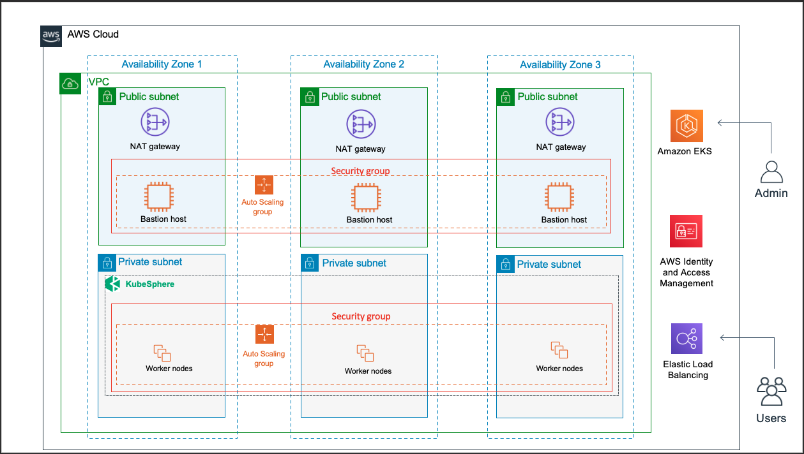

Deploying this Quick Start for a new virtual private cloud (VPC) with *default parameters* builds the following KubeSphere environment in the AWS Cloud.

// Replace this example diagram with your own. Send us your source PowerPoint file. Be sure to follow our guidelines here : http://(we should include these points on our contributors giude)
[#architecture1]
.Quick Start architecture for _{partner-product-short-name}_ on AWS
[link=images/architecture_diagram.png]

As shown in figure 1, the Quick Start sets up the following::

* A highly available VPC architecture that spans three Availability Zones. The VPC is configured with public and private subnets, according to AWS best practices, to provide you with your own virtual network on AWS.*
In the public subnets:
** Managed network address translation (NAT) gateways to allow outbound internet access for resources in the private subnets.*
** A Linux bastion host in an Auto Scaling group to allow inbound Secure Shell (SSH) access to administer the KubeSphere platform and Amazon EKS environment *
In the private subnets:
** One Amazon Elastic Compute Cloud (Amazon EC2) instance that functions as a Kubernetes node in an Auto Scaling group. KubeSphere core components and your applications run on this node. You can configure the number of instances.
* An Amazon EKS cluster, which provides the Kubernetes control plane.
* In the private subnets, a group of Kubernetes nodes.

*The template that deploys the Quick Start into an existing VPC skips the components marked by asterisks and prompts you for your existing VPC configuration.